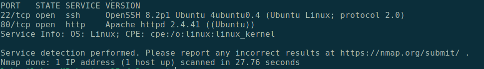

# Hacker vs. Hacker TryHackMe Room 
Difficulty: Easy

 **Prompt:**
The server of this recruitment company appears to have been hacked, and the hacker has defeated all attempts by the admins to fix the machine. They can't shut it down (they'd lose SEO!) so maybe you can help?

Run a nmap scan using the -sV flag (services and versions).

`nmap -sV http://10.10.95.41/`

Current Goal: find services that either have a version that is out of date and can be exploited or anything misconfigured.

Results: 

We can see that port 80 (HTTP) and port 22 (SSH) are open. From here we can look to see if there is anything exploitable on the website.
As well as run an enumuration tool on the website, like Dirb"

As we look on the webpage we see there is the ability to upload a CV. 

I tried to upload a php file to no avail. It states I should get better at filtering. 
I may need to modify the file name to obsfucate it so it doesnt get rejected. (Tried multiple different ways of obsfucating it.)

Looking at the page sources we see on the upload directory it has been edited by the hacker we see that there are specific guidelines to only using pdf files. 
I try again masking the php extension with a pdf extension 'code.php.pdf'. This method does not work so I assume the hacker has already patched it after exploiting it.

As I cant upload my own explotation as it is now patched I try elsewhere to exploit this webserver. Checking my enumuration tool I used earlier we see a few directories listed. 
The most important Directory being the CVS directory which after looking it up on google is a special directory that holds files. 

Thinking about our earlier incident with the hacker probably uploading their own shell it would most likely be listed in this directory. 
Meaning we should use Dirb once again!

This time we will have to be specific with dirb using a special flag '-x' that looks for the file .pdf. As we cannot find their php file otherwise 
COMMAND HERE(dirb -x .pdf

